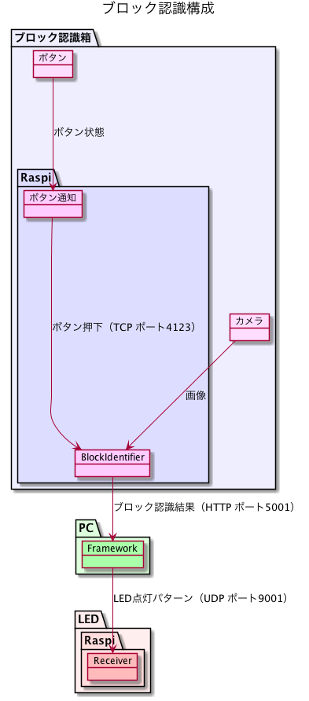

# FXAT勉強会チーム ブロック認識プログラム

## 注意

本プログラムはC++で実装していますが、カメラ関係の処理で不都合があるため、[Python版](https://github.com/YGFYHD2018/block_identifier)に移植されました。

## 本プログラム

カメラから入力した画像の中からLEGOブロックを探し出して、色と大きさを認識するプログラム。  
認識したブロックのパターンはPCへ送信され、3D LEDが点灯する。  
PCのプログラムは以下にある。    
https://github.com/tatsuo98se/3d_led_cube2

## 最新バージョン

- 2.0.0

## 言語

- c++11(XCODEで開発)

## ライブラリ

- opencv (3.4.1_2)
- boost (1.67.0_1)
- picojson

## 動作環境

Raspberry Pi

## 構成図

## コマンドラインオプション

  -h [ --help ]            Show help  
  -v [ --version ]         Print software version  
  -g [ --generate ]        Generate option file  
  -o [ --option ] arg      Option file path  
  -a [ --address ] arg     Python process IP address  
  -p [ --port ] arg (=80)  Python process port number  

## RaspberryPi環境構築

RaspberryPiセットアップ手順

* SDカードイメージ  
2018-04-18-raspbian-stretch.zip
* SSH有効  
sshという名称の空ファイルを作る
* パスワード変更（to 警告消す）  
`sudo raspi-config`
* apt-getアップデート  
`sudo apt-get update`  
`sudo apt-get upgrade`
* vimインストール  
`sudo apt-get install vim`
* FTP有効  
http://yamaryu0508.hatenablog.com/entry/2014/12/02/102648
* リモートデスクトップ有効  
`sudo apt-get install xrdp`
* boost, opencvインストール  
`sudo apt-get install libopencv-dev libboost1.62-all`
* bcm2835インストール  
`sudo wget http://www.airspayce.com/mikem/bcm2835/bcm2835-1.44.tar.gz`  
`tar zxvf bcm2835-1.44.tar.gz`  
`cd bcm2835-1.44/`  
`sudo ./configure`  
`sudo make`  
`sudo make install`  
* カメラ有効  
`sudo raspi-config`  
5 Interfacing Options  
P1 Camera  
Yes  
OK  
Finish  
* RaspiCamCVインストール  
https://github.com/hiroshi-mikuriya/facedetect をクローンする  
`sudo cp libraspicamcv.so /usr/lib`  
`sudo cp RaspiCamCV.h /usr/include`
* LEGO認識インストール  
`git clone https://github.com/hiroshi-mikuriya/block_identifier`  
`cd block_identifier/make`  
`make`
* LEGO認識自動起動  
`sudo chmod 777 run.sh`  
`vim ~/.config/lxsession/LXDE-pi/autostart`  
以下追記  
`@/home/pi/block_identifier/make/run.sh`
* LEGOボタン自動起動  
`sudo vim /etc/rc.local`  
以下追記  
`cd /home/pi/block_identifier/button`  
`sudo ruby main.rb`  
* ETH固定IP化  
`sudo vim /etc/dhcpcd.conf`  
以下追記  
`interface eth0`  
`static ip_address=192.168.0.21`  
`static routers=192.168.0.1`

## 参考
* [raspicam_cv](https://github.com/robidouille/robidouille/tree/master/raspicam_cv)
* [Raspberry Piの設定【FTPサーバ（vsftpd）の設定】](http://yamaryu0508.hatenablog.com/entry/2014/12/02/102648)
* [Raspberry Pi 3Bのスリープモード解除](http://www.pentacreation.com/blog/2017/07/170712.html)
